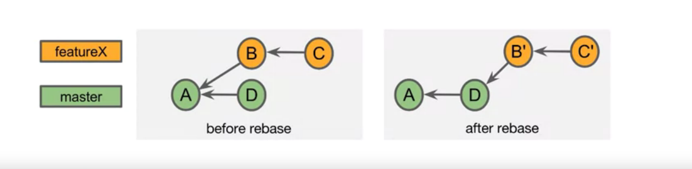
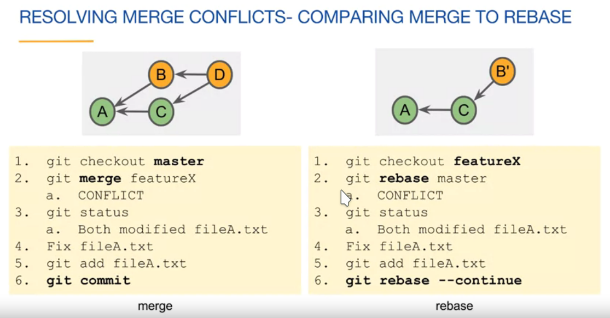
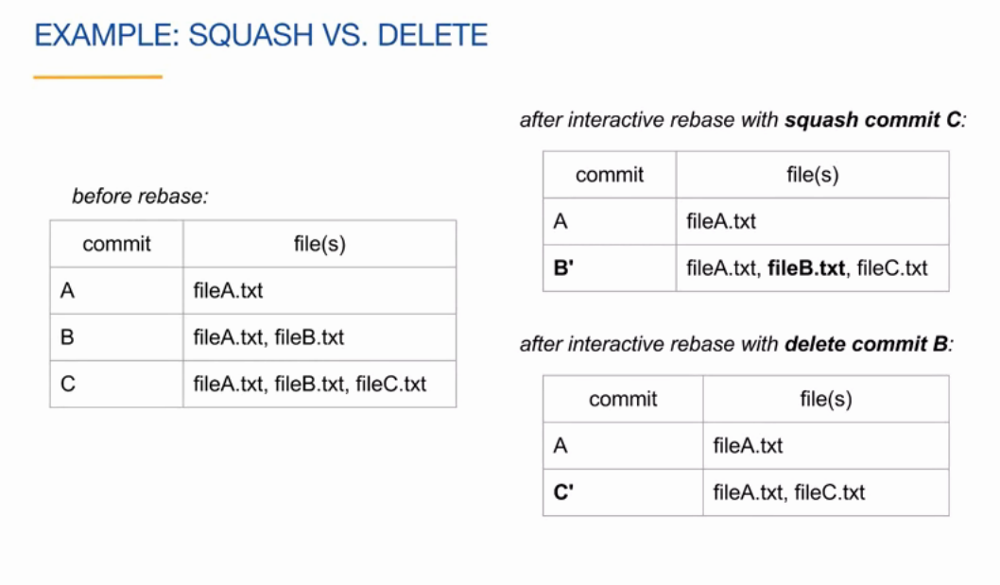

- **Each commit contains a snapshot of the previous project**
- **Git can calculate the difference between commits**
	- this is known as a diff or a patch

git log --oneline --graph --all
git checkout

## Create a branch an checkout on it
git checkout -b <branch_name>

## Delete a branch
git branch -d <branch_name>
git branch -D <branch_name>

## For undoing a branch delete execute
git reflog
git checkout -b <branch_name> [SHA-1 YOU COPIED]

## Fast Forward Merge: Only if no new commits on the master. Just move the HEAD to the beginning of the branch
- Checkout master
- merge branch, FF is the defaul merge
- delete the branch label

	git checkout master
	git merge feature2
	# delete the branch label
	git branch -d feauture2

## Merge Commit: combines the commits at the tips of the merged branches, places the result in the merge commit. Has multiple parents.

	git checkout master
	git merge featureX
	git branche -d featurex
	# performing a Merge commit instead of an FF merge
	git merge --no-ff featurex
	
## Merge Conclicts
- checkout the master 
- merge featureX 
	- Conflict: both modified the same "hunk" fileA.txt
- fix conflict fileA
- stage fileA 
- commit the merge commit
- delete the branch label 

## Tracking Branches
- are local branches that represent remote branches
- are named <remote>/<branch>, for example origin/master
- can become out of synch with local branches
- updated with network commands like, clone, fetch, pull and push

## Network commands
- **Clone**: copies a remote repository
- **Fetch**: retrieves new objects and references from the remote
- **Pull**: fetches and merges commits locally
- **Push**: adds new objects and references to the remote repository

**Fetch**: git fetch <repo>
	- retrieves new objects an references from another repo without merging it with the actual work 
	- not merged with the local work

**Pull**: combines **git fetch** and **git merge**
- if objects are fetched, the tracking branch is merge into the current branch ( like a topic branch merging into a base branch)
- merging options
	- --ff fast forward if possible, else merge commit
	- --no-ff always include a merge commit
	- --ff-only cancel il doing a merge commit
	- --rebase conserve-merges

**Push**: adding commits to the remote repository 
- -u track this branch (--set-upstream)

**Rebase**: rewriting commit history
- **so not rewrite history that has been shared with others**
- normal rebase
- interactive rebase

**Rebase moves commits to a new parent (base)**
- after the rebase no need for a **merge commit**
- a FF commit can be applied

- **Each commit contains a snapshot of the previous project**
- **Git can calculate the difference between commits**
	- this is known as a diff or a patch

Rebasing Pros and Cons:
- Pros
	- we can incorporate changes from the parent branch
		- we can use the new features/bugfixes
		- test are on more current code
		- it makes the eventual merge into a master ff
	- avoids **unnecessary** commits
		- it allows us to shape/define clean commits histories
- Cons:
	- merge conflicts may need to be resolved
	- il can cause problems if our commits have been shared because it changes the commit id
	- not preserving the commit history, we are rewriting the commit history

Change the parent of the currently checked branch to <upstream>
	git rebase <upstream>

"Upstream" usually refers the parent branch of the rebase branch

Checkout <branch> and changes its parent <upstream>
	
	git checkout <branch>
	git rebase master

	# equivalent
	git rebase master <branch>

Fixing a merge conflict while rebasing:

	git checkout featureX
	git rebase master
	--conflict on fileA
	git status
	-- fix conflict
	git add fileA.txt
	git rebase --continue

We want to rebase the feature branch to the master branch.

	git rebase master
    -- conflict on fileA
    -- resolve the conflict
    git status
    git add .
    git rebase --continue

Merge vs Rebase conflicts:

**Rebasing moves a branch to the tip of another branch**. In this way the branch will have access to all the new features added to the master during the new commits.

## Rewriting history
Fixing the commit message, during this process the SHA-1 changes

    git commit --amend -m "new commit msg"

Updating the content of a file, new SHA-1

    - edit the file already committed without changing the commit msg
    git commit --amend --no-edit

## Interactive Rebase
- Interactive rebase lets you edit commits using commands
    - the commits can belong to any branch
    - the commit history is changed

    git rebase -i <after-this-commit>

## Delete a Commit
Just rebase to the previous commit

    git rebase -i <to the new base>
    - choose the "drop" for the first line

## SQUASH a Commit
- applies a newer (squashed) commit to an older commit
- combines the commit messages
- removes the newer commit

It combines the work of two commits on one commit

    # we select the base in the way to work and combine his children
    git rebase -i <the new base>
    - change the pick to squash for the most recent commit in the way to combine the work of the two commits

SQUASH vs DELETE
- Squash: combine the commit with the older commit, creating a single commit, the work of both commits is included
- Delete: no changes from this commit are applied
    - diff is thrown out
    - work is lost
    - greater chance of merge conflicts

## Squash Merges
- merges the tip of the feature branch onto the tip of the base branch
- place the result in the staging area
- the result can be committed

During a squash merge, the branch i merged onto the base and the branch history is deleted having a in this way a linear history.

    git checkout master
    git merge --squash featureX
    git commit
    -- squash msg
    git branch -d featureX

The squash is pretty complicated.